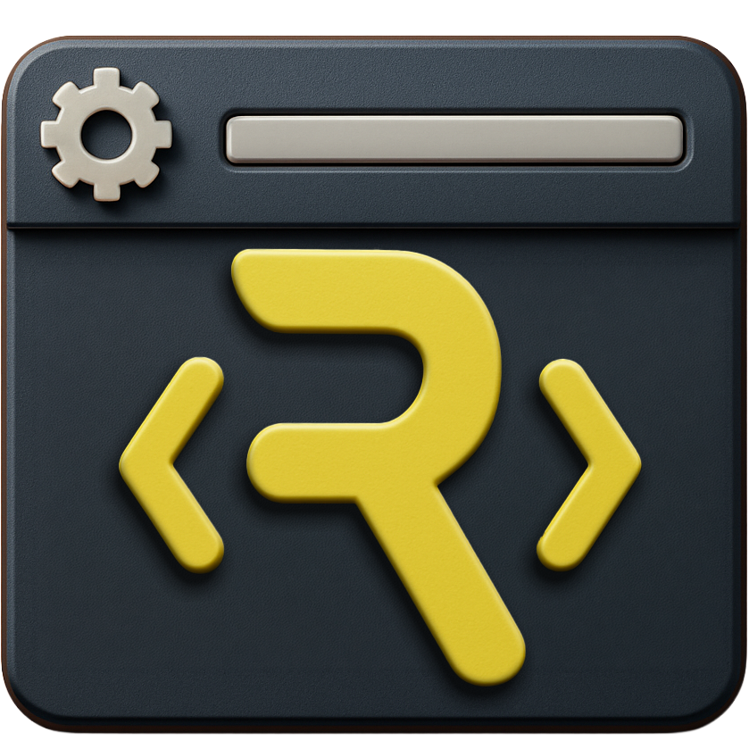

# Rive Luau LSP

<p align="center">
  
</p>

<p align="center">
  <strong>A VS Code language server for Rive's Luau scripting environment.</strong><br>
  Rich tooltips, autocomplete, diagnostics, and IntelliSense — designed for artists and designers learning to code.
</p>

---

## Features

- **Autocomplete** — context-aware suggestions for the entire Rive scripting API, standard Luau library, and your own code
- **Hover documentation** — educational tooltips that explain every type, method, property, and parameter in plain English with practical examples
- **Real-time diagnostics** — catches type errors, missing properties, and undefined variables as you type
- **Go-to-definition** — jump to where any symbol is defined
- **Syntax highlighting** — full Luau grammar support including Markdown code blocks
- **Custom file icons** — `.luau` files get a distinctive icon in the explorer

### Documentation Philosophy

Every tooltip is written for people who **do not code for a living**. The Rive Luau scripting audience is primarily artists and motion designers learning to script. Tooltips explain concepts in visual/conceptual terms, use analogies, show practical examples with context, and warn about common mistakes in plain language.

Examples:

```
drawPath — "Render a shape on screen. This is the core drawing call in Rive scripting.
You give it two things: path (what to draw) and paint (how it looks)."

clipPath — "Mask all future drawing to only appear inside this shape.
Like cutting a hole in paper — after clipPath(), only the area inside the clip path is visible."

BlendMode — "Controls how overlapping shapes blend together — like Photoshop layer blend modes.
multiply = darken, screen = lighten, overlay = contrast boost."
```

---

## CLI Usage (for agents and automation)

The repo includes standalone CLI tools for type checking and static analysis — no VS Code required. Use these from scripts, CI pipelines, or AI coding agents.

### Quick Start

```bash
git clone https://github.com/ivg-design/rive-luau-lsp.git
cd rive-luau-lsp

# Analyze a single file
bin/rive-luau-analyze path/to/script.luau

# Analyze an entire directory
bin/rive-luau-analyze path/to/effects/

# Start the LSP server (for editor/agent integration via stdio)
bin/rive-luau-lsp
```

### `rive-luau-analyze` — Static Analysis

Runs type checking, linting, and diagnostics on Rive Luau files. Automatically loads the complete Rive API type definitions. Exit code 0 means no errors.

```bash
# Check a script for type errors
bin/rive-luau-analyze effects/Glassifier/Glassifier.luau

# Check all scripts in a directory (respects .luaurc if present)
bin/rive-luau-analyze effects/

# Pass additional luau-lsp flags
bin/rive-luau-analyze myScript.luau --formatter=plain
```

### `rive-luau-lsp` — Language Server

Starts the full language server over stdio with Rive definitions and documentation pre-loaded. Connect from any LSP-compatible client: Neovim, Emacs, Helix, Zed, or an AI agent.

```bash
# Start LSP server
bin/rive-luau-lsp

# With additional flags
bin/rive-luau-lsp --flag:LuauSomeFlag=true
```

### Agent Integration Example

An AI coding agent can use the analyze tool to validate Rive Luau code:

```bash
# After generating or modifying a script, validate it:
result=$(bin/rive-luau-analyze generated_script.luau 2>&1)
if [ $? -ne 0 ]; then
    echo "Type errors found:"
    echo "$result"
    # Agent can fix errors and retry
fi
```

---

## AI Agent Skills

Ready-to-install skill packages for AI coding agents. Each skill gives the agent access to the Rive Luau type checker, API reference, script patterns, and a validation workflow.

### Claude Code

Install by copying into your personal or project skills directory:

```bash
# Personal (available in all projects)
cp -r skills/claude/rive-luau-lsp ~/.claude/skills/

# Project-level (available in one repo)
cp -r skills/claude/rive-luau-lsp .claude/skills/
```

Then invoke with `/rive-luau-lsp` or let Claude auto-trigger when working with `.luau` files.

See [`skills/claude/rive-luau-lsp/SKILL.md`](skills/claude/rive-luau-lsp/SKILL.md)

### OpenAI Codex

Install by copying into your user or project skills directory:

```bash
# Personal
cp -r skills/codex/rive-luau-lsp ~/.agents/skills/

# Project-level
cp -r skills/codex/rive-luau-lsp .agents/skills/
```

Codex will auto-trigger the skill when working with Rive Luau scripts.

See [`skills/codex/rive-luau-lsp/SKILL.md`](skills/codex/rive-luau-lsp/SKILL.md) and [`skills/codex/rive-luau-lsp/agents/openai.yaml`](skills/codex/rive-luau-lsp/agents/openai.yaml)

### Other LSP-Compatible Editors (Cursor, Windsurf, Neovim, etc.)

Point your editor's LSP configuration to the language server:

```json
{
  "luau": {
    "command": "/path/to/rive-luau-lsp/bin/rive-luau-lsp",
    "filetypes": ["luau"]
  }
}
```

---

## VS Code Extension

### From VSIX (recommended)

1. Download the latest `.vsix` from the [Releases](https://github.com/ivg-design/rive-luau-lsp/releases) page
2. In VS Code, open the Command Palette (`Cmd+Shift+P` / `Ctrl+Shift+P`)
3. Run **"Extensions: Install from VSIX..."**
4. Select the downloaded `.vsix` file
5. Reload VS Code

### From Source

```bash
git clone https://github.com/ivg-design/rive-luau-lsp.git
cd rive-luau-lsp/extension
npm install
npx @vscode/vsce package --allow-missing-repository
code --install-extension rive-luau-*.vsix
```

---

## What's Included

### Language Server (`bin/luau-lsp`)

A modified build of [luau-lsp](https://github.com/JohnnyMorganz/luau-lsp) by JohnnyMorganz with Rive-specific changes:

- **Ancestor-walk require resolution** — Rive resolves `require("lib/Module")` from the script root directory, not the file's directory. The LSP walks up parent directories to find the correct module, eliminating false "Module not found" errors.
- **Local-only documentation** — All hover tooltips render locally without "Learn More" links to external websites.
- **Data namespace type resolution** — `Input<Data.X>` resolves in type annotations via a namespace fallback system, matching Rive editor syntax. `Data.X.new()` returns a typed ViewModel instance with dynamic property access.

### Type Definitions (`definitions/rive-globals.d.luau`)

Complete Rive scripting API type definitions with educational documentation covering:

| Category | Types |
|----------|-------|
| **Core** | `Vector`, `Color`, `Mat2D` |
| **Drawing** | `Path`, `Paint`, `Renderer`, `Gradient`, `PathMeasure`, `ContourMeasure`, `ImageSampler` |
| **Scene** | `NodeData`, `NodeReadData`, `Artboard`, `Animation` |
| **Data Binding** | `ViewModel`, `Property<T>`, `PropertyList`, `DataContext`, `Context`, `Data` namespace |
| **Assets** | `Image`, `Blob`, `AudioSource`, `AudioSound`, `Audio` |
| **Script Protocols** | `Node<T>`, `Layout<T>`, `Converter<T,I,O>`, `PathEffect<T>`, `ListenerAction<T>`, `TransitionCondition<T>` |
| **Data Values** | `DataValue`, `DataValueNumber`, `DataValueString`, `DataValueBoolean`, `DataValueColor` |
| **Events** | `PointerEvent` |
| **Testing** | `Tester`, `Expectation` |

### Standard Library Documentation (`definitions/luau-api-docs.json`)

655 symbol entries covering the entire Luau standard library, all rewritten with educational descriptions:

- **math** — 30 functions + 7 constants (floor, ceil, clamp, lerp, sin, cos, noise, etc.)
- **string** — 17 functions (find, format, gsub, split, sub, etc.)
- **table** — 17 functions (insert, remove, sort, find, move, freeze, etc.)
- **bit32** — 15 functions (band, bor, bxor, lshift, rshift, etc.)
- **Global functions** — print, require, type, tostring, tonumber, assert, error, pcall, xpcall, pairs, ipairs, select, unpack, and more
- **coroutine, debug, os, utf8, buffer** — full coverage

---

## File Icon

The extension includes a custom icon for `.luau` files that appears automatically in the VS Code explorer (when your icon theme doesn't define its own `.luau` icon).

For a dedicated icon theme, open the Command Palette and select **"Preferences: File Icon Theme"** → **"Rive Luau Icons"**.

---

## Configuration

| Setting | Default | Description |
|---------|---------|-------------|
| `rive-luau.trace.server` | `"off"` | Traces communication between VS Code and the language server. Set to `"messages"` or `"verbose"` for debugging. |

---

## Project Structure

```
rive-luau-lsp/
├── README.md
├── CHANGELOG.md
├── LICENSE                        # MIT
├── ATTRIBUTION.md                 # Credits to upstream projects
├── bin/
│   ├── luau-lsp                   # Language server binary (macOS)
│   ├── rive-luau-analyze          # CLI: static analysis & type checking
│   └── rive-luau-lsp             # CLI: start LSP server (stdio)
├── definitions/
│   ├── rive-globals.d.luau        # Rive API type definitions (with docs)
│   └── luau-api-docs.json         # Standard library documentation
└── extension/                     # VS Code extension source
    ├── package.json               # Extension manifest
    ├── extension.js               # Extension entry point
    ├── icon.png                   # Extension marketplace icon
    ├── README.md                  # Marketplace page content
    ├── language-configuration.json
    ├── bin/
    │   └── luau-lsp               # Language server binary (bundled)
    ├── definitions/
    │   ├── rive-globals.d.luau    # Rive API type definitions (bundled)
    │   └── luau-api-docs.json     # Standard library docs (bundled)
    ├── icons/
    │   ├── luau.svg               # File icon for .luau files
    │   ├── file-icon-theme.json   # Icon theme definition
    │   └── ...                    # Generic fallback icons
    └── syntaxes/
        ├── Luau.tmLanguage.json   # Syntax highlighting grammar
        └── codeblock.json         # Markdown code block injection
```

---

## Building from Source

### Prerequisites

- Node.js 18+
- npm
- VS Code 1.80+

### Build the Extension

```bash
cd extension
npm install
npx @vscode/vsce package --allow-missing-repository
```

### Build the Language Server (optional)

To rebuild the language server binary from source, clone the modified luau-lsp fork and build with CMake:

```bash
git clone https://github.com/ivg-design/luau-lsp.git
cd luau-lsp
mkdir build && cd build
cmake .. -DCMAKE_BUILD_TYPE=Release
cmake --build . --target luau-lsp -j
```

Copy the resulting binary to `extension/bin/luau-lsp`.

---

## Attribution

This project stands on the shoulders of open source software:

- **[Rive](https://github.com/rive-app/rive-runtime)** — Copyright (c) 2020 Rive. The scripting API and type definitions are based on Rive's official documentation and runtime (MIT License)
- **[luau-lsp](https://github.com/JohnnyMorganz/luau-lsp)** — Copyright (c) 2022 JohnnyMorganz. The language server that powers everything (MIT License)
- **[Luau](https://github.com/luau-lang/luau)** — Copyright (c) 2019-2025 Roblox Corporation; Copyright (c) 1994-2019 Lua.org, PUC-Rio. The scripting language itself (MIT License)
- **[Lua](https://www.lua.org)** — Copyright (c) 1994-2019 Lua.org, PUC-Rio. The language Luau is derived from (MIT License)

See [ATTRIBUTION.md](ATTRIBUTION.md) for full details.

---

## License

[MIT](LICENSE)
