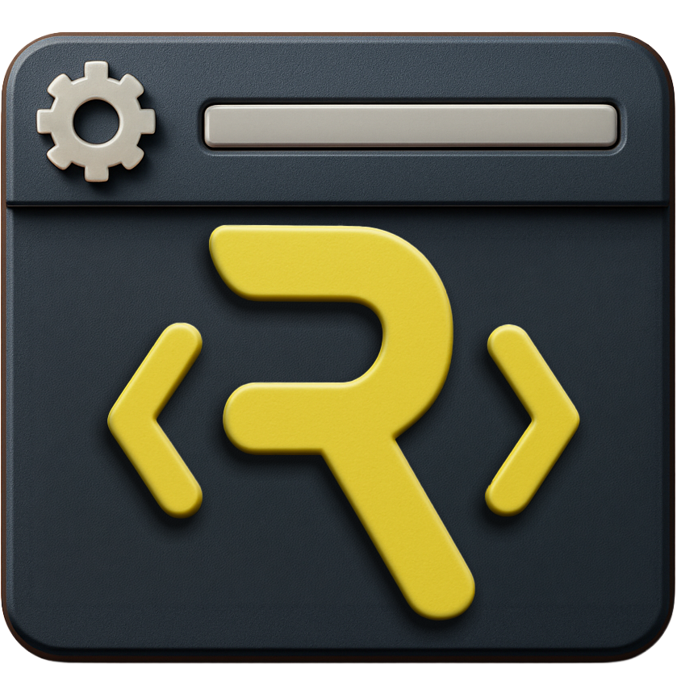

# Rive Luau LSP

<p align="center">
  
</p>

<p align="center">
  <strong>A VS Code language server for Rive's Luau scripting environment.</strong><br>
  Rich tooltips, autocomplete, diagnostics, and IntelliSense — designed for artists and designers learning to code.
</p>

<p align="center">
  <a href="LICENSE">
    
  </a>

  <a href="https://marketplace.visualstudio.com/items?itemName=IVGDesign.rive-luau">
    
  </a>

  <a href="https://marketplace.visualstudio.com/items?itemName=IVGDesign.rive-luau">
    
  </a>

  <a href="https://marketplace.visualstudio.com/items?itemName=IVGDesign.rive-luau">
    
  </a>

  <a href="https://github.com/ivg-design/rive-luau-lsp/stargazers">
    
  </a>

  <a href="https://github.com/ivg-design/rive-luau-lsp/releases/latest">
    
  </a>
</p>

---

## Features

- **Autocomplete** — context-aware suggestions for the entire Rive scripting API, standard Luau library, and your own code
- **Hover documentation** — educational tooltips that explain every type, method, property, and parameter in plain English with practical examples
- **Real-time diagnostics** — catches type errors, missing properties, and undefined variables as you type
- **Go-to-definition** — jump to where any symbol is defined
- **Syntax highlighting** — full Luau grammar support including Markdown code blocks
- **Custom file icons** — `.luau` files get a distinctive icon in the explorer

### Documentation Philosophy

Every tooltip is written for people who **do not code for a living**. The Rive Luau scripting audience is primarily artists and motion designers learning to script. Tooltips explain concepts in visual/conceptual terms, use analogies, show practical examples with context, and warn about common mistakes in plain language.

Examples:

```
drawPath — "Render a shape on screen. This is the core drawing call in Rive scripting.
You give it two things: path (what to draw) and paint (how it looks)."

clipPath — "Mask all future drawing to only appear inside this shape.
Like cutting a hole in paper — after clipPath(), only the area inside the clip path is visible."

BlendMode — "Controls how overlapping shapes blend together — like Photoshop layer blend modes.
multiply = darken, screen = lighten, overlay = contrast boost."
```

---

## CLI Usage (for agents and automation)

The supported default install is a prebuilt CLI archive from the [GitHub Releases](https://github.com/ivg-design/rive-luau-lsp/releases) page. Choose the matching `rive-luau-cli-*.zip`, extract it, and keep the binary, wrappers, definitions, and documentation in the same directory.

Release builds provide CLI archives for Windows x64 (`rive-luau-win64`), Linux x64 (`rive-luau-linux-x86_64`), and macOS Apple Silicon (`rive-luau-macos`). The extension release separately provides native VSIX packages for Windows x64/arm64, Linux x64, and macOS x64/arm64. Build from source when a prebuilt CLI archive does not match the host architecture.

### Release archive quick start

On macOS or Linux:

```bash
unzip rive-luau-cli-*.zip -d rive-luau-cli
cd rive-luau-cli
chmod 755 luau-lsp rive-luau-analyze rive-luau-lsp

./rive-luau-analyze --formatter=plain path/to/script.luau
./rive-luau-lsp
```

On Windows, run the binary directly from PowerShell. The extensionless wrappers can also be used from Git Bash.

```powershell
.\luau-lsp.exe analyze `
  --definitions=@rive=.\rive-globals.d.luau `
  --flag:LuauSolverV2=true `
  --force-strict-mode `
  path\to\script.luau
```

`rive-luau-analyze` returns 0 only when the analyzer emits no diagnostics, 1 when diagnostics are present, and the underlying process status when analysis fails. A clean result is static evidence only: it does not execute the script in the Rive editor or runtime and does not prove export, rendering, event, or playback behavior.

### Build a source checkout before using it

A fresh checkout contains source and shell wrappers, but no usable language-server binary. Initialize Luau, apply the tracked Rive patch, and build before running the repository paths:

```bash
git clone https://github.com/ivg-design/rive-luau-lsp.git
cd rive-luau-lsp
git submodule update --init luau
git -C luau apply ../patches/luau-rive-mods.patch

cmake -S . -B build -DCMAKE_BUILD_TYPE=Release
cmake --build build --target Luau.LanguageServer.CLI -j 4

./bin/rive/rive-luau-analyze --formatter=plain path/to/script.luau
./bin/rive/rive-luau-lsp
```

From another working directory, invoke either source wrapper by absolute path. Each wrapper resolves its binary, definitions, and documentation from its own checkout location rather than from the caller's current directory.

The analyzer accepts one or more files or directories and passes analyzer options to `luau-lsp analyze`. Put every option before the first path; arguments after a path are interpreted as more input paths:

```bash
./bin/rive/rive-luau-analyze effects/
./bin/rive/rive-luau-analyze --formatter=plain myScript.luau
```

### Direct language-server command

The `rive-luau-lsp` wrapper starts the language server over stdio with the bundled Rive definitions, Luau documentation, SolverV2, and forced strict mode. Configure the wrapper itself as the LSP client command; it adds the `lsp` subcommand. It does not print one-shot diagnostics. An LSP client can invoke the binary directly with the same settings:

```bash
./luau-lsp lsp \
  --definitions=@rive=./rive-globals.d.luau \
  --docs=./luau-api-docs.json \
  --flag:LuauSolverV2=true \
  --force-strict-mode
```

## AI Agent Skills

Ready-to-install skill packages for AI coding agents. Each skill gives the agent access to the Rive Luau type checker, API reference, script patterns, and a validation workflow.

### Claude Code

Install by copying into your personal or project skills directory:

```bash
# Personal (available in all projects)
cp -r skills/claude/rive-luau-lsp ~/.claude/skills/

# Project-level (available in one repo)
cp -r skills/claude/rive-luau-lsp .claude/skills/
```

Then invoke with `/rive-luau-lsp` or let Claude auto-trigger when working with `.luau` files.

See [`skills/claude/rive-luau-lsp/SKILL.md`](skills/claude/rive-luau-lsp/SKILL.md)

### OpenAI Codex

Install by copying into your user or project skills directory:

```bash
# Personal
cp -r skills/codex/rive-luau-lsp ~/.agents/skills/

# Project-level
cp -r skills/codex/rive-luau-lsp .agents/skills/
```

Codex will auto-trigger the skill when working with Rive Luau scripts.

See [`skills/codex/rive-luau-lsp/SKILL.md`](skills/codex/rive-luau-lsp/SKILL.md) and [`skills/codex/rive-luau-lsp/agents/openai.yaml`](skills/codex/rive-luau-lsp/agents/openai.yaml)

### Other LSP-Compatible Editors (Cursor, Windsurf, Neovim, etc.)

Point your editor's LSP configuration to the language server:

```json
{
  "luau": {
    "command": "/path/to/rive-luau-lsp/bin/rive/rive-luau-lsp",
    "filetypes": ["luau"]
  }
}
```

---

## VS Code Extension

### From VSIX (recommended)

1. Download the latest `.vsix` from the [Releases](https://github.com/ivg-design/rive-luau-lsp/releases) page
2. In VS Code, open the Command Palette (`Cmd+Shift+P` / `Ctrl+Shift+P`)
3. Run **"Extensions: Install from VSIX..."**
4. Select the downloaded `.vsix` file
5. Reload VS Code

### From Source

```bash
git clone https://github.com/ivg-design/rive-luau-lsp.git
cd rive-luau-lsp
git submodule update --init luau
git -C luau apply ../patches/luau-rive-mods.patch
cmake -S . -B build -DCMAKE_BUILD_TYPE=Release
cmake --build build --target Luau.LanguageServer.CLI -j 4
mkdir -p extension/bin
cp build/luau-lsp extension/bin/luau-lsp
chmod 755 extension/bin/luau-lsp
npm ci --prefix extension
cd extension
npx @vscode/vsce package
code --install-extension rive-luau-*.vsix
```

On Windows, copy `build/Release/luau-lsp.exe` into `extension/bin/` before packaging.

---

## What's Included

### Language Server (`bin/rive/luau-lsp`)

A modified build of [luau-lsp](https://github.com/JohnnyMorganz/luau-lsp) by JohnnyMorganz with Rive-specific changes:

- **Ancestor-walk require resolution** — Rive resolves `require("lib/Module")` from the script root directory, not the file's directory. The LSP walks up parent directories to find the correct module, eliminating false "Module not found" errors.
- **Local-only documentation** — All hover tooltips render locally without "Learn More" links to external websites.
- **Data namespace type resolution** — `Input<Data.X>` resolves in type annotations via a namespace fallback system, matching Rive editor syntax. `Data.X.new()` returns a typed ViewModel instance with dynamic property access.

### Type Definitions (`extension/definitions/rive-globals.d.luau`)

The callable runtime tier targets released Rive Web 2.41.1 / C++ `runtime-v0.1.344`, which embeds the `rive_0_734` Luau fork. The LSP uses Luau 0.736 for parsing and type checking; that does not upgrade the target runtime. `Layout.resize(self, size, displayScale)` now includes the released presenting-surface scale; existing two-parameter Luau callbacks remain runtime-compatible. `FileFormat` and `TextFileFormat` are current stable Editor protocols. Source-backed GPU declarations remain early access and require target-Editor verification. Types labeled **Coming soon** remain reference-only.

| Category | Types |
|----------|-------|
| **Core** | `Vector`, `Color`, `Mat2D`, `Mat4`, `Promise`, runtime buffer half-float/stride/conversion helpers |
| **Drawing** | `Path`, `PathCommand`, `PathData`, `Paint`, `Renderer`, `Gradient`, `PathMeasure`, `ContourMeasure`, `ImageSampler`, `Canvas`, `GPUCanvas` |
| **GPU Shaders** | `Shader`, `GPUBuffer`, `GPUTexture`, `GPUTextureView`, `GPUSampler`, `GPUPipeline`, `GPUBindGroupLayout`, `GPUBindGroup`, `GPURenderPass` |
| **Scene** | `NodeData`, `NodeReadData`, `Artboard<T>`, `Animation` |
| **Data Binding** | `ViewModel`, `Property<T>`, `PropertyImage`, `PropertyList`, `DataContext`, `Context`, `Data` namespace |
| **Assets** | `Image`, `Blob`, `Font`, `AudioSource`, `AudioSound`, `Audio` |
| **Script Protocols** | `Node<T>`, `Layout<T>`, `Converter<T,I,O>`, `PathEffect<T>`, `ListenerAction<T>`, `TransitionCondition<T>`, `Interpolator<T>`, `FileFormat`, `TextFileFormat` |
| **Data Values** | `DataValue`, `DataValueNumber`, `DataValueString`, `DataValueBoolean`, `DataValueColor` |
| **Events** | `PointerEvent`, `KeyboardEvent`, `TextInput`, `FocusEvent`, `ReportedEvent`, `ViewModelChange`, `NoneEvent`, `GamepadConnected`, `GamepadEvent`, `GamepadDisconnected`, `ListenerContext` |
| **File-format support** | `FormatDocument`, `FormatView`, `FormatSurface`, scopes, tokens, diagnostics, completions, hover, editor theme/scroll/context callbacks |
| **Testing** | `Tests`, `Tester`, `Expect`, `Expectation` |

Rive Script Modules are ordinary Luau modules loaded with `require("name")`.
The standard-platform resolver walks ancestor directories for bare module paths,
matching Rive workspace behavior. Host-generated or serialized asset identifiers
belong to file metadata; they are not source-level module names or LSP symbols.

### Standard Library Documentation (`definitions/luau-api-docs.json`)

655 symbol entries covering the entire Luau standard library, all rewritten with educational descriptions:

- **math** — 30 functions + 7 constants (floor, ceil, clamp, lerp, sin, cos, noise, etc.)
- **string** — 17 functions (find, format, gsub, split, sub, etc.)
- **table** — 17 functions (insert, remove, sort, find, move, freeze, etc.)
- **bit32** — 15 functions (band, bor, bxor, lshift, rshift, etc.)
- **Global functions** — print, require, type, tostring, tonumber, assert, error, pcall, xpcall, pairs, ipairs, select, unpack, and more
- **coroutine, debug, os, utf8, buffer** — full coverage

---

## File Icon

The extension includes a custom icon for `.luau` files that appears automatically in the VS Code explorer (when your icon theme doesn't define its own `.luau` icon).

For a dedicated icon theme, open the Command Palette and select **"Preferences: File Icon Theme"** → **"Rive Luau Icons"**.

---

## Configuration

| Setting | Default | Description |
|---------|---------|-------------|
| `rive-luau.trace.server` | `"off"` | Traces communication between VS Code and the language server. Set to `"messages"` or `"verbose"` for debugging. |

---

## Project Structure

```
rive-luau-lsp/
├── README.md
├── CHANGELOG.md
├── LICENSE                        # MIT
├── ATTRIBUTION.md                 # Credits to upstream projects
├── bin/
│   └── rive/
│       ├── luau-lsp               # Language server binary (macOS)
│       ├── rive-luau-analyze      # CLI: static analysis & type checking
│       └── rive-luau-lsp          # CLI: start LSP server (stdio)
└── extension/                     # VS Code extension source
    ├── package.json               # Extension manifest
    ├── extension.js               # Extension entry point
    ├── icon.png                   # Extension marketplace icon
    ├── README.md                  # Marketplace page content
    ├── language-configuration.json
    ├── bin/
    │   └── luau-lsp               # Language server binary (bundled)
    ├── definitions/
    │   ├── rive-globals.d.luau    # Rive API type definitions (bundled)
    │   └── luau-api-docs.json     # Standard library docs (bundled)
    ├── icons/
    │   ├── luau.svg               # File icon for .luau files
    │   ├── file-icon-theme.json   # Icon theme definition
    │   └── ...                    # Generic fallback icons
    └── syntaxes/
        ├── Luau.tmLanguage.json   # Syntax highlighting grammar
        └── codeblock.json         # Markdown code block injection
```

---

## Building from Source

A source checkout must build the native language-server binary before the CLI wrappers or extension can run.

### Prerequisites

- CMake and a C++20 compiler
- Node.js 20 and npm for VSIX packaging
- VS Code 1.82+ for local extension installation

### Build and test the language server

```bash
git clone https://github.com/ivg-design/rive-luau-lsp.git
cd rive-luau-lsp
git submodule update --init luau
git -C luau apply ../patches/luau-rive-mods.patch

cmake -S . -B build -DCMAKE_BUILD_TYPE=Release
cmake --build build --target Luau.LanguageServer.CLI Luau.LanguageServer.Test -j 4
./build/Luau.LanguageServer.Test
```

The repository wrappers automatically fall back to `build/luau-lsp` after that build.

### Package a local VSIX

Copy the native binary for the host platform into the extension before packaging it:

```bash
mkdir -p extension/bin
cp build/luau-lsp extension/bin/luau-lsp
chmod 755 extension/bin/luau-lsp
npm ci --prefix extension
cd extension
npx @vscode/vsce package
```

On Windows, copy `build/Release/luau-lsp.exe` to `extension/bin/luau-lsp.exe` instead.

---

## Attribution

This project stands on the shoulders of open source software:

- **[Rive](https://github.com/rive-app/rive-runtime)** — Copyright (c) 2020 Rive. The scripting API and type definitions are based on Rive's official documentation and runtime (MIT License)
- **[luau-lsp](https://github.com/JohnnyMorganz/luau-lsp)** — Copyright (c) 2022 JohnnyMorganz. The language server that powers everything (MIT License)
- **[Luau](https://github.com/luau-lang/luau)** — Copyright (c) 2019-2025 Roblox Corporation; Copyright (c) 1994-2019 Lua.org, PUC-Rio. The scripting language itself (MIT License)
- **[Lua](https://www.lua.org)** — Copyright (c) 1994-2019 Lua.org, PUC-Rio. The language Luau is derived from (MIT License)

See [ATTRIBUTION.md](ATTRIBUTION.md) for full details.

---

## License

[MIT](LICENSE)
